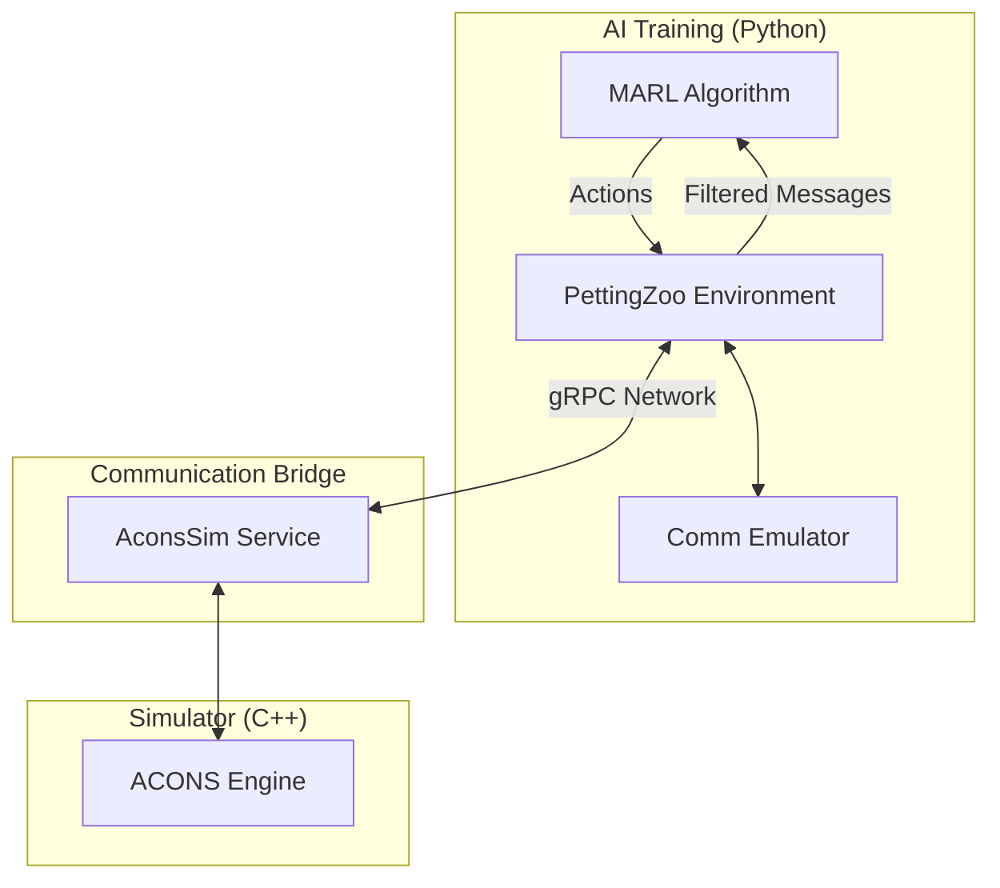

# ACONS-PettingZoo Integration: Multi-Agent Reinforcement Learning with Communication Constraints
## 1. Executive Summary
This project bridges the gap between high-fidelity tactical simulators (ACONS) and modern Artificial Intelligence training frameworks (PettingZoo/Gymnasium). It allows AI agents (e.g., autonomous underwater vehicles or drones) to learn complex coordination strategies while operating under realistic communication constraints like limited bandwidth, message delays, and signal loss.
---
## 2. The Problem: "The Sim-to-Real Gap"
In many real-world scenarios, agents cannot communicate perfectly. Most AI training environments assume "magic" instant communication. When these AI models are deployed in the real world (underwater, remote areas), they fail because they haven't learned to handle:
1. **Limited Bandwidth ($B$ bits):** Only so many bits can be sent per step.
2. **Latency ($L$ steps):** Information takes time to travel.
3. **Packet Loss ($p$):** Sometimes messages just don't arrive.
**Our Solution:** We've implemented a **Communication Constraint Emulator (CC-Emu)** that sits between the AI and the Simulator, forcing the AI to "feel" these constraints during training.
---
## 3. High-Level Architecture
The system is divided into three main layers:

### Key Components:
- **PettingZoo Environment (`acons_env.py`)**: The "Skin" that makes the simulator look like a standard AI playground. it follows the AEC (Agent-Environment Cycle) pattern.
- **Comm Emulator (`comm_emulator.py`)**: The "Filter" that enforces $B, L, p$ constraints. It handles all message timing and reliability locally in Python for maximum speed.
- **gRPC Interface (`acons_sim.proto`)**: The "Language" used by Python and C++ to talk to each other over the network.
- **Reward Extractor (`extractor.py`)**: The "Judge" that translates simulator events (like "Mine Neutralized") into mathematical scores for the AI.
---
## 4. How Communication Works ($B, L, p$)
When an agent wants to send a message, it doesn't just "happen." It goes through a three-step pipeline:
1. **Bandwidth Check**: If an agent tries to send 100 bits but the limit is 50, only the most important 50 bits (or nothing) get through.
2. **Loss Check**: A random roll determines if the message is "dropped" by interference.
3. **Latency Delay**: If the latency is 2 steps, the message is stored in a queue and delivered exactly 2 turns later.
---
## 5. Reward Shaping: Helping the AI Learn
Learning is hard when rewards are rare (e.g., only getting points at the very end of a 10-minute mission). We use **Potential-Based Reward Shaping**:
- Instead of just getting a score for the final result, we give the AI small "nudges" based on its progress.
- Our formula: $R_{total} = R_{env} + \beta(\gamma V(s') - V(s))$
- **Non-Technical Translation:** We reward the AI for moving into "better" situations, but we do it in a way that doesn't "trick" the AI into doing repetitive useless actions for points.
---
## 6. Directory Structure
```
/Masterthesis
├── proto/              # Network definitions (gRPC)
├── src/
│   ├── pettingzoo_env/ # Core integration logic & Comm Emulator
│   ├── reward/         # Reward logic & configuration
│   ├── env_server/     # (Mock) Simulator server for testing
│   └── training/       # AI training scripts & policy logic
└── tests/              # Quality assurance (Unit tests)
```
---
## 7. Business/Mission Value
- **Scalability**: Can handle 2 to 100+ agents.
- **Flexibility**: Swap the communication model (e.g., "Underwater Acoustic" vs "Satellite Link") by changing three numbers ($B, L, p$).
- **Consistency**: The AI won't "cheat" by using information it wouldn't have in the real world.
---
## 8. For Developers: Getting Started
1. **Compile Protos**: `python -m grpc_tools.protoc ...`
2. **Start Mock Server**: `python src/env_server/server.py`
3. **Run Training**: `python src/training/runner.py`
4. **Run Tests**: Use the `./run_tests.ps1` script to ensure everything is working correctly.
